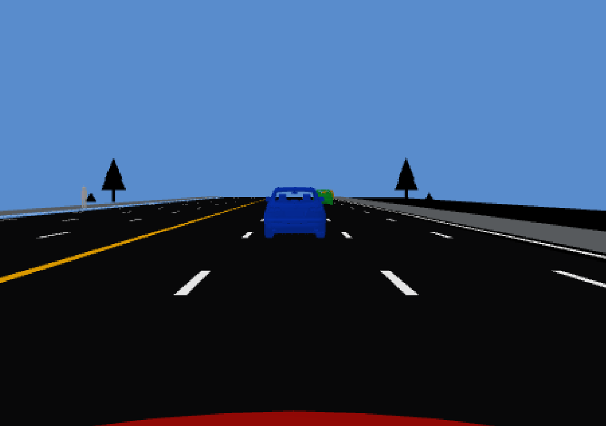
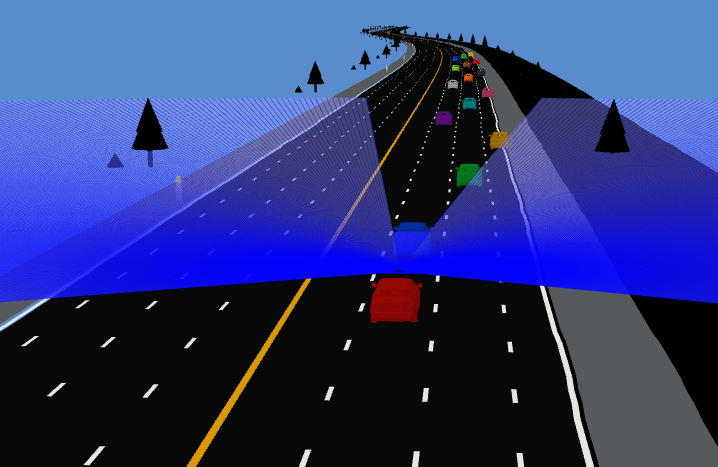

# Traffic Map — ROS 2 OpenDRIVE Simulation

This project loads an OpenDRIVE (`.xodr`) map and visualizes it with ROS 2 Humble. The primary Gazebo simulation provides a game-style ego-car view, multi-lane traffic, pedestrians, roadside scenery, lidar, a dashboard camera, obstacle avoidance, braking, and physical crash behavior.

An RViz 2 marker-based visualization is also included as a lightweight alternative.

## Features

- Complete OpenDRIVE road mesh generated from the XODR map
- Asphalt, solid edge markings, dashed lane markings, and yellow divider
- Audi Q7 GLB vehicle model converted automatically for Gazebo Classic
- Red ego vehicle with a chase camera
- Up to 16 differently colored traffic vehicles
- Endless traffic recycling ahead of the ego vehicle
- Lane-aware following, acceleration, braking, and obstacle avoidance
- Dynamic collision bodies with mass, inertia, friction, and crash physics
- Footpaths, moving pedestrians, grass, shrubs, and roadside trees
- Dashboard RGB camera
- 360-degree dashboard lidar with a 150 m range
- ROS 2 camera and `LaserScan` topics

## Screenshots

### Dashboard camera



### Ego lidar



## Supported system

- Ubuntu 22.04
- ROS 2 Humble
- Gazebo Classic 11

## Install dependencies

Install ROS 2 Humble Desktop first, then install the project dependencies:

```bash
sudo apt update
sudo apt install \
  ros-humble-desktop \
  ros-humble-gazebo-ros-pkgs \
  ros-humble-rqt-image-view \
  python3-colcon-common-extensions \
  libpugixml-dev \
  libassimp-dev
```

Verify the main programs:

```bash
gazebo --version
ros2 --help
colcon --help
```

## Run the complete Gazebo simulation

From the project directory:

```bash
cd ~/Desktop/traffic_map
./run_gazebo.sh
```

The script automatically:

1. Sources ROS 2 Humble.
2. Builds the package with `colcon`.
3. Parses the XODR map.
4. Generates the road, markings, footpaths, and vegetation meshes.
5. Converts `cars/Audi_Q7_2009.glb` to a Gazebo-compatible textured OBJ.
6. Starts `gzserver` and waits for the world to initialize.
7. Opens the Gazebo graphical client.

Close the Gazebo window or press `Ctrl+C` in the launch terminal to stop the simulation server.

## Open the dashboard camera

Keep `run_gazebo.sh` running. In a second terminal, run:

```bash
cd ~/Desktop/traffic_map
./view_camera.sh
```

Select this image topic in `rqt_image_view`:

```text
/ego/dashboard_camera/image_raw
```

`view_camera.sh` removes incompatible Snap Core20 and Qt environment variables that can otherwise cause errors involving `/snap/core20/.../libpthread.so.0`.

## Lidar

The ego dashboard lidar currently has:

- Horizontal FOV: 360 degrees
- Range: 0.2–150 metres
- Samples: 1,080 per scan
- Update rate: 20 Hz
- Message type: `sensor_msgs/msg/LaserScan`
- Topic: `/ego/dashboard_lidar/scan`
- Frame: `dashboard_lidar`

Inspect the scan in another terminal:

```bash
source /opt/ros/humble/setup.bash
source ~/Desktop/traffic_map/install/setup.bash
ros2 topic echo /ego/dashboard_lidar/scan
```

Check its publication rate:

```bash
ros2 topic hz /ego/dashboard_lidar/scan
```

List all ego sensor topics:

```bash
ros2 topic list | grep ego
```

## Traffic behavior

The ego begins at 20 m/s. Other vehicles use different lower target speeds and spawn ahead across three lanes. Each car monitors its lane and adjusts its speed according to the available distance:

- Normal acceleration is limited for smooth speed recovery.
- Cars reduce speed when approaching slower traffic.
- Emergency braking is applied at short distances.
- Vehicles do not intentionally pass through a car in the same lane.
- Passed vehicles remain behind for at least 100 m before being recycled ahead.
- If braking is insufficient, route control is released and Gazebo handles the collision using vehicle mass, inertia, momentum, ground contact, and friction.

## Change the number of vehicles

The default is 16 vehicles, including the ego. Supported values are 1–16:

```bash
TRAFFIC_VEHICLE_COUNT=8 ./run_gazebo.sh
```

Fewer vehicles reduce GPU and CPU usage.

## Use another OpenDRIVE map

Pass an absolute XODR path through `FILEPATH`:

```bash
FILEPATH=/absolute/path/to/map.xodr ./run_gazebo.sh
```

The map must contain usable road geometry and lane information.

## Use another GLB car model

The default source model is:

```text
cars/Audi_Q7_2009.glb
```

Use another GLB file with:

```bash
TRAFFIC_CAR_MESH=/absolute/path/to/car.glb ./run_gazebo.sh
```

The launcher converts the GLB and extracts its embedded textures into `build/gazebo_assets/`. Models with different coordinate axes or dimensions may require pose and collision-size adjustments in `src/traffic_world_plugin.cpp`.

## Run the RViz 2 visualization

For the original ROS 2 marker visualization:

```bash
./run.sh
```

Set the RViz vehicle speed with a decimal value:

```bash
VEHICLE_SPEED_MPS=3.0 ./run.sh
```

Use another map in RViz:

```bash
FILEPATH=/absolute/path/to/map.xodr ./run.sh
```

Use a different installed ROS 2 distribution for the RViz launcher:

```bash
ROS_DISTRO=jazzy ./run.sh
```

The Gazebo workflow is developed and tested for ROS 2 Humble and Gazebo Classic 11.

## Build manually

```bash
source /opt/ros/humble/setup.bash
cd ~/Desktop/traffic_map
colcon build --symlink-install
source install/setup.bash
```

## Record sensor data

Record the lidar and dashboard camera:

```bash
ros2 bag record \
  /ego/dashboard_lidar/scan \
  /ego/dashboard_camera/image_raw \
  /ego/dashboard_camera/camera_info
```

Stop recording with `Ctrl+C`.

## Troubleshooting

### Snap Core20 `libpthread` error

If launching `rqt_image_view` directly reports a symbol lookup error from `/snap/core20`, use:

```bash
./view_camera.sh
```

### Camera topic does not appear

Confirm that Gazebo is running, then check:

```bash
ros2 topic list | grep dashboard
```

Also check the `gzserver` terminal for errors involving `libgazebo_ros_camera.so`.

### Lidar topic does not appear

Verify that the Gazebo ROS ray plugin is installed:

```bash
ls /opt/ros/humble/lib/libgazebo_ros_ray_sensor.so
```

If it is missing:

```bash
sudo apt install ros-humble-gazebo-ros-pkgs
```

### Gazebo is slow

Reduce the traffic count:

```bash
TRAFFIC_VEHICLE_COUNT=6 ./run_gazebo.sh
```

Close RViz and other GPU-intensive applications while Gazebo is running.

### Model database warning

The project uses a local Gazebo model database and local assets. Internet access to the public Gazebo model database is not required.
